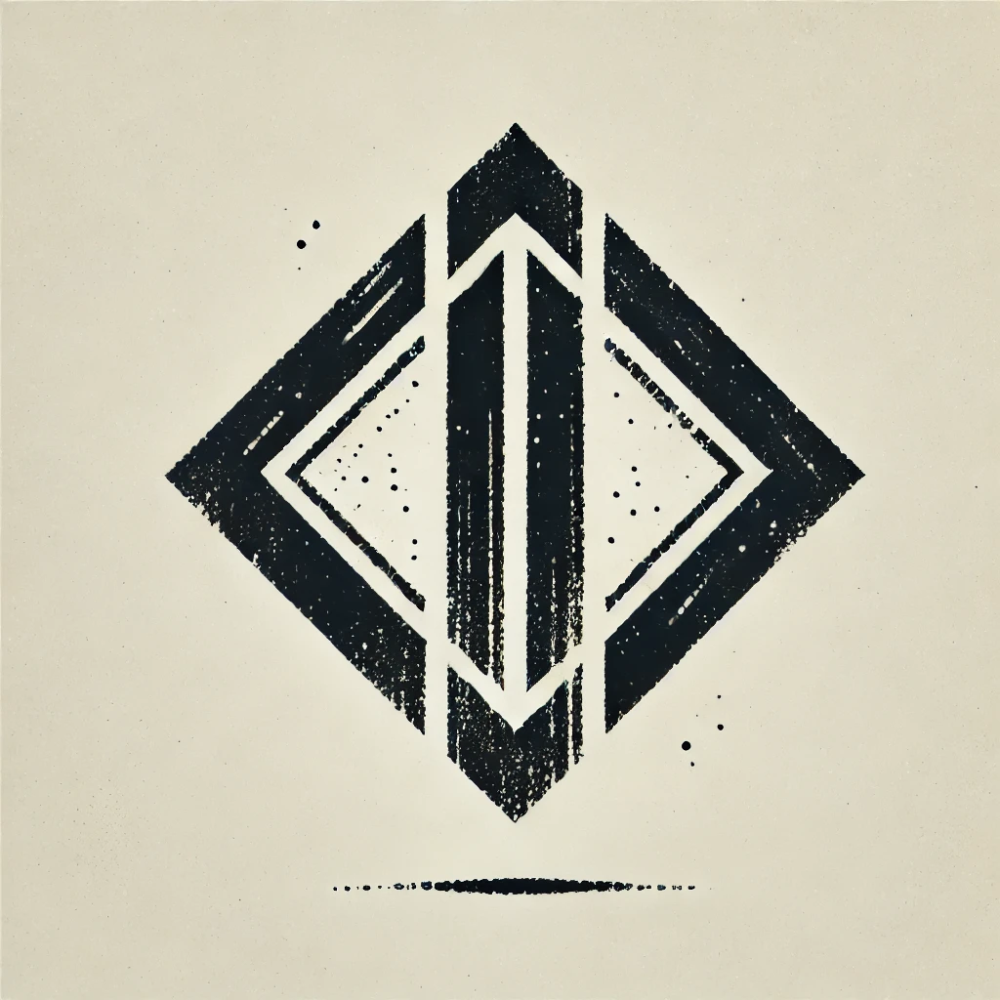

# FEATHER AI Platform



An advanced AI-driven crypto management platform that combines natural language processing with sophisticated portfolio management.

## Core Features

- Natural language crypto trading & management
- Advanced portfolio optimization
- Real-time market analysis
- Cross-chain operations
- Interactive neural visualizations

## Tech Stack

- Next.js 14 with TypeScript
- Framer Motion for animations
- WebGL for neural visualizations
- Django backend with Claude AI integration
- Web3 integration for crypto operations

## Project Structure

- `/components/ai` - Core AI interaction components
- `/components/common` - Shared UI components
- `/hooks` - Custom React hooks for AI/Audio/Gestures
- `/utils` - Utility functions and parsers

## Local Development

```bash
# Install dependencies
yarn install

# Run development server
yarn dev

# Run tests
yarn test

# Build for production
yarn build
```

## AI Integration

The platform uses Claude AI for natural language processing and decision-making. Key capabilities:

- Context-aware conversations
- Multi-chain transaction processing
- Market analysis and predictions
- Portfolio optimization

## Contributing

We welcome contributions! Please see our [Contributing Guidelines](CONTRIBUTING.md) for details.

## License

MIT License - see [LICENSE](LICENSE) for details.

## Acknowledgments

- [Anthropic](https://anthropic.com) for Claude AI

## Inspiration

"Any sufficiently advanced technology is indistinguishable from magic."

— Arthur C. Clarke