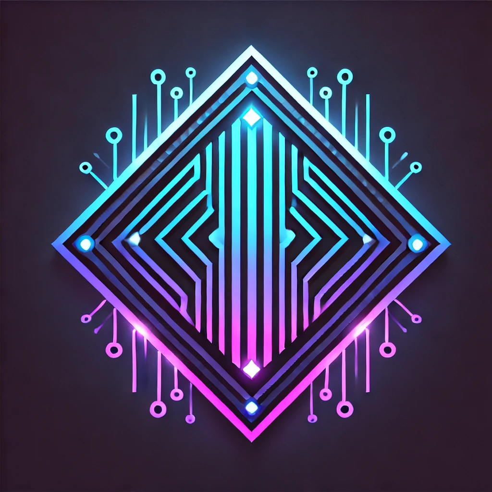

# KIRIGAMI AI Platform



An advanced AI-driven crypto management platform that combines natural language processing with sophisticated portfolio management.

## Core Features

- Natural language crypto trading & management
- Advanced portfolio optimization
- Real-time market analysis
- Cross-chain operations
- Interactive neural visualizations

## Tech Stack

- Next.js 14 with TypeScript
- Framer Motion for animations
- WebGL for neural visualizations
- Django backend with Claude AI integration
- Web3 integration for crypto operations

## Project Structure

/kiri
/gami
 /app
   /api
     /chat
     /process
   globals.css
   layout.tsx
   page.tsx

 /components
   AIChat.tsx              # Main chat interface
   AIPersonality.tsx       # Personality visualization
   AIProvider.tsx          # AI context provider
   InteractionFeedback.tsx # System feedback
   Button.tsx
   FeatherProvider.tsx      # Feature management
   FeaturesSection.tsx 
   HeroSection.tsx
   MarketAnalysis.tsx
   PortfolioOptimizer.tsx
   RewardsSystem.tsx
   StatsSection.tsx
   ThemeProvider.tsx
   Transitions.tsx

 /hooks
   useActionHandler.ts      # Action execution
   useAICore.ts            # Core AI functionality
   useAudio.ts             # Voice processing  
   useNeuralAnimation.ts   # Particle effects

 /state
   aiState.ts             # Central AI state

 /types
   actions.ts
   ai.ts
   chat.ts 
   interactions.ts

 /utils
   animationSystem.ts
   audioProcessor.ts
   responseParser.ts

 /public
   DARKFEATHER.png


## Local Development

```bash
# Install dependencies
bun install

# Run development server
bun run dev

# Run tests
bun run test

# Build for production
bun run build
```

## AI Integration

The platform uses Claude AI for natural language processing and decision-making. Key capabilities:

- Context-aware conversations
- Multi-chain transaction processing
- Market analysis and predictions
- Portfolio optimization

## Contributing

We welcome contributions! Please see our [Contributing Guidelines](CONTRIBUTING.md) for details.

## License

MIT License - see [LICENSE](LICENSE) for details.

## Acknowledgments

- [Anthropic](https://anthropic.com) for Claude AI

## Inspiration

"Any sufficiently advanced technology is indistinguishable from magic."

— Arthur C. Clarke